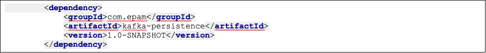
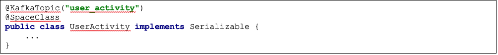
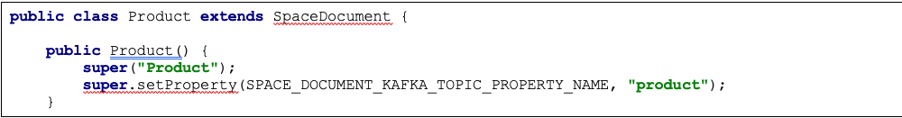

# GigaSpaces XAP and Kafka integration

## Introduction

Apache Kafka is a high-throughput distributed messaging system.
This project is aimed to integrate GigaSpaces with Apache Kafka so that GigaSpaces persists data operations to Kafka. Kafka is used in a sense of external data store. The data is Kafka in available for subscription for a range of use cases including loading into Hadoop or offline data warehousing systems for offline reporting and processing.

Kafka persistence is essentially an implementation of SpaceSynchronizationEndpoint. It takes a batch of data sync operations, converts them to a custom message protocol and sends to Kafka server using Kafka Producer API.

GigaSpace-Kafka protocol is simple and represents data operation. The message consists of operation type and data. Data itself could be represented either as a single object or as a dictionary of key/values. Object corresponds to Space entity and dictionary to SpaceDocument. Since message should be sent over the wire, they should be serialized to bytes in some way. The default encoder utilizes Java serialization mechanism which implies Space classes (domain model) be serializable. 

By default Kafka messages are uniformly distributed among Kafka partitions. Please note, even though data sync operations appear ordered in SpaceSynchronizationEndpoint, it doesn’t imply correct ordering of data processing in Kafka consumers. Please see the picture below for details:

## Getting started

There is an example application located in <project_root>/example which demonstrates how to configure Kafka persistence and implement a simple Kafka consumer.

In order to run an example, please follow the instruction below:

#### 1.Install Kafka  
        Follow step 1:
        https://kafka.apache.org/quickstart
#### 2. Run insightedge/xap 
        ./gs.sh host run-agent --auto --gsc=4
#### 3.	Start Kafka server  
        $KAFKA_HOME/bin/kafka-server-start.sh config/server.properties
#### 4. initials environment variables: 
        cd <project_root>/example/dev-scripts
        edit set-env.sh
#### 5.	Build project  
        ./rebuild.sh
#### 6.	Deploy example to GigaSpaces  
        ./deploy
#### 7.	Check GigaSpaces log files, there should be messages printed by Feeder and Consumer. 

## Configuration

### Library dependency

The following maven dependency needs to be included to your project in order to use Kafka persistence. This artifact is built from <project_rood>/kafka-persistence source directory.

### Mirror service 

Here is an example of Kafka Space Synchronization Endpoint configuration.

Please consult [Kafka documentation](https://kafka.apache.org/documentation.html#producerconfigs) for the full list of available producer properties.
The default properties applied to Kafka producer are the following:

These default properties could be overridden if there is a need to customize GigaSpace-Kafka protocol. See Customization section below for details.

### Space class

In order to associate Kafka topic with domain model class, class should be annotated with @KafkaTopic annotation and marked as Serializable. Here is an example

### Space documents

To configure Kafka topic for SpaceDocuments or Extended SpaceDocument, the property KafkaPersistenceConstants.SPACE_DOCUMENT_KAFKA_TOPIC_PROPERTY_NAME should be added to document. Here is an example

It’s also possible to configure name of the property which defines the Kafka topic for SpaceDocuments. Set spaceDocumentKafkaTopicName to the desired value as shown below.

### Kafka consumers

Kafka persistence library provides a wrapper around native Kafka Consumer API to preset configuration responsible for GigaSpace-Kafka protocol serialization. Please see com.epam.openspaces.persistency.kafka.consumer.KafkaConsumer, example of how to use it could be found in <project_root>/example module.

## Customization

Kafka persistence was designed to be extensible and customizable. 

If you need to create a custom protocol between GigaSpace and Kafka, provide an implementation of AbstractKafkaMessage, AbstractKafkaMessageKey, AbstractKafkaMessageFactory.

If you’d like to customize how data sync operations are sent to Kafka or how Kafka topic is chosen for given entity, provide an implement of AbstractKafkaSpaceSynchronizationEndpoint.

If you want to create a custom serializer, look at KafkaMessageDecoder and KafkaMessageKeyDecoder.

Kafka Producer client (which is used under the hood) could be configured with a number of settings, see Kafka documentation.
